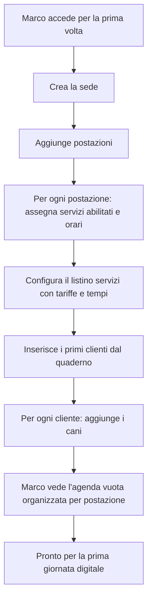
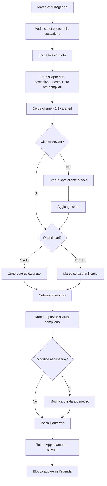
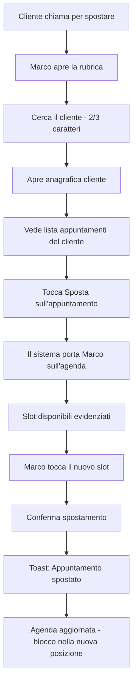
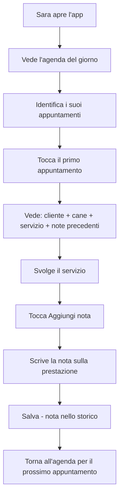

# UX Design Specification dog-grooming

**Author:** Samueles
**Date:** 2026-02-07

---

## Executive Summary

### Visione del Progetto

Dog-grooming e' una piattaforma web gestionale verticale per tolettature per cani, progettata per sostituire la gestione manuale (carta, chiamate, WhatsApp) con un sistema digitale veloce e intuitivo. L'MVP si concentra su due pilastri: la presa appuntamenti rapida (target <30 secondi) e la visione chiara dell'agenda organizzata per sede e postazione. La piattaforma e' pensata per micro-saloni in crescita e costruita per evolvere in un SaaS multi-tenant con integrazioni AI.

### Utenti Target

**Marco — Il Titolare Operativo (Amministratore)**
30-40 anni, bassa competenza tecnologica. Lavora direttamente sui cani e gestisce contemporaneamente l'attivita'. Ha le mani occupate, risponde al telefono tra un servizio e l'altro, gestisce tutto su carta e WhatsApp. Sta crescendo e non riesce piu' a scalare. Cerca un sistema che gli permetta di prenotare in pochi secondi e vedere tutta la giornata organizzata senza caos.

**Sara — La Collaboratrice (Collaboratore)**
20-40 anni, spesso part-time. Non gestisce l'organizzazione del salone. Ha bisogno di sapere "cosa ho oggi?", accedere rapidamente alle informazioni su clienti e cani, e aggiungere note sulle prestazioni. Cerca chiarezza e autonomia operativa.

**Nota:** La maggior parte dei saloni sono micro-saloni gestiti dal solo titolare. L'MVP deve digitalizzare il lavoro manuale gia' esistente senza aggiungere complessita'.

### Sfide di Design Chiave

- **Velocita' con mani occupate:** L'interfaccia deve funzionare con pochi tocchi, su smartphone, con mani potenzialmente bagnate. Target: appuntamento completo in <30 secondi dalla ricerca cliente alla conferma.
- **Bassa competenza tecnologica:** Interfaccia immediatamente comprensibile, senza curva di apprendimento. Le operazioni quotidiane non devono richiedere formazione.
- **Transizione carta → digitale:** La vista agenda deve essere piu' chiara e veloce del quaderno di carta, non piu' complessa. Deve sembrare un'evoluzione naturale.

### Opportunita' di Design

- **Flusso di prenotazione "killer":** Un flusso cosi' veloce e naturale da diventare il motore di adozione della piattaforma. Se prenoti piu' velocemente che su carta, il prodotto si vende da solo.
- **Metafora del quaderno digitale:** Sfruttare la familiarita' con strumenti analogici come punto di partenza visivo per l'agenda.
- **Valore crescente tramite storico note:** Le note sulle prestazioni costruiscono un patrimonio informativo che rende il sistema progressivamente indispensabile — piu' lo usi, piu' vale.

## Core User Experience

### Esperienza Definente

Il cuore di dog-grooming si articola su due pilastri operativi inseparabili:

1. **Presa e gestione appuntamenti rapida** — Prenotare, spostare e cancellare appuntamenti deve essere un gesto fluido, completabile in pochi secondi. Il flusso deve essere ottimizzato per la velocita': meno tocchi possibile, dati pre-compilati dove possibile, conferma immediata.

2. **Visualizzazione agenda strutturata** — L'agenda non e' solo una lista di appuntamenti: e' lo strumento di controllo del salone. Deve far emergere a colpo d'occhio la struttura della settimana, evidenziando buchi, tempi morti e spazi liberi tra le postazioni. Marco deve guardare l'agenda e capire immediatamente dove puo' ottimizzare.

Questi due pilastri si alimentano a vicenda: una buona visualizzazione rende la presa appuntamento piu' veloce (vedi subito dove inserire), e una presa appuntamento veloce mantiene l'agenda sempre aggiornata e affidabile.

### Strategia Piattaforma

- **Web app responsive** — nessuna app nativa. Smartphone per la presa appuntamento rapida durante il lavoro, desktop/tablet per la consultazione e riorganizzazione dell'agenda.
- **Mobile-first per la prenotazione** — il flusso di presa appuntamento e' progettato prima per smartphone (mani occupate, tocchi rapidi).
- **Desktop-friendly per l'agenda** — la vista settimanale per sede/postazione sfrutta lo schermo piu' ampio per dare il quadro completo.
- **Nessuna funzionalita' offline** nell'MVP — connessione richiesta.

### Interazioni Senza Attrito

- **Durata semi-automatica:** Il sistema pre-compila la durata dell'appuntamento dalla definizione del servizio, ma l'operatore puo' modificarla manualmente per casi particolari (es. cane grande, pelo annodato, trattamento combinato).
- **Prezzo semi-automatico:** Come la durata, il prezzo viene pre-compilato dalla tariffa del servizio ma resta modificabile per eccezioni.
- **Agenda contestuale:** L'app si apre sulla giornata corrente, sulla sede pertinente. Nessuna navigazione superflua per arrivare a "oggi".
- **Ricerca cliente veloce:** Pochi caratteri bastano per trovare il cliente. I clienti recenti o abituali emergono rapidamente.
- **Buchi visibili:** Gli slot liberi e i tempi morti sono visivamente evidenti nell'agenda, senza bisogno di contarli o calcolarli mentalmente.

### Momenti Critici di Successo

- **Il momento "aha!":** Marco guarda l'agenda e ha tutto sotto controllo — con facilita'. Vede la settimana, le postazioni, i buchi, gli appuntamenti. Nessun caos, nessun dubbio. Questo e' il momento in cui sa che non tornera' piu' alla carta.
- **La prenotazione lampo:** La cliente chiama, Marco cerca il nome, sceglie il cane, il servizio si auto-compila con durata e prezzo, tocca lo slot libero, conferma. Fatto prima che la cliente finisca la frase.
- **Lo spostamento fluido:** Un appuntamento va spostato. Marco lo seleziona, vede gli slot disponibili, lo trascina o riposiziona. L'agenda si aggiorna. Nessuna cancellatura, nessun pasticcio.
- **L'onboarding senza paura:** Marco configura il salone la prima sera. Il giorno dopo usa il sistema. Nessun manuale, nessuna formazione necessaria per le operazioni base.

### Principi di Esperienza

1. **Controllo immediato** — L'utente deve avere la sensazione di controllo totale sulla propria agenda in ogni momento. Un colpo d'occhio basta per capire la situazione.
2. **Velocita' prima di tutto** — Ogni interazione frequente (prenotare, spostare, consultare) deve essere completabile nel minor numero di passaggi possibile. Se un'azione puo' essere piu' veloce, deve esserlo.
3. **Intelligente ma modificabile** — Il sistema propone (durata, prezzo, slot), l'utente decide. I default sono intelligenti, le eccezioni sono sempre possibili senza attrito.
4. **Chiarezza visiva** — L'informazione importante (buchi, sovrapposizioni, appuntamenti) deve emergere visivamente senza richiedere interpretazione. L'agenda parla da sola.

## Desired Emotional Response

### Obiettivi Emotivi Primari

**Controllo sereno** — L'emozione dominante di dog-grooming e' una combinazione di padronanza e leggerezza. Marco deve sentirsi in controllo totale della sua attivita' senza che questo controllo richieda sforzo. Non e' il controllo rigido di un sistema complesso, e' il controllo naturale di chi ha tutto sotto mano e sa esattamente dove guardare.

**Semplicita' come sollievo** — Ogni interazione deve trasmettere la sensazione che le cose siano piu' semplici di prima, mai piu' complesse. Il software elimina strati di caos, non ne aggiunge. L'utente deve pensare: "perche' non l'ho avuto prima?"

### Mappa Emotiva del Percorso Utente

| Momento | Emozione desiderata |
|---------|-------------------|
| **Primo accesso / Onboarding** | "E' piu' semplice di quello che pensavo" — sorpresa positiva, nessuna ansia |
| **Consultazione agenda al mattino** | "Ho tutto chiaro" — padronanza, tranquillita' |
| **Presa appuntamento durante il lavoro** | "Fatto, senza neanche pensarci" — leggerezza, fluidita' |
| **Gestione imprevisti (cancellazioni, spostamenti)** | "Nessun problema, lo risolvo subito" — sicurezza, fiducia nello strumento |
| **Fine giornata** | "Tutto registrato, tutto in ordine" — soddisfazione, senso di professionalita' |
| **Ritorno il giorno dopo** | "Apro e so gia' cosa mi aspetta" — familiarita', comfort |

### Micro-Emozioni Critiche

**Da coltivare:**
- **Fiducia** — Il sistema funziona, i dati sono li', non perdo niente. Mi fido a lasciare la carta.
- **Competenza** — Anche con bassa competenza tecnologica, mi sento capace. L'interfaccia non mi mette in difficolta'.
- **Fluidita'** — Le azioni si concatenano in modo naturale. Non mi fermo mai a chiedermi "e ora cosa faccio?"
- **Soddisfazione silenziosa** — Non servono animazioni celebrative. La soddisfazione viene dal fatto che le cose funzionano, semplicemente.

**Da evitare categoricamente:**
- **Complessita' percepita** — Mai. Nessuna schermata deve far pensare "questo e' complicato". Se succede, abbiamo fallito.
- **Confusione** — L'utente non deve mai sentirsi perso o non sapere dove andare.
- **Inadeguatezza** — L'utente a bassa competenza tecnologica non deve mai sentirsi stupido o incapace.
- **Sovraccarico** — Troppe opzioni, troppi dati, troppi passaggi. Meno e' sempre meglio.

### Implicazioni di Design

- **Complessita' → Semplicita':** Ogni schermata deve avere uno scopo chiaro e un'azione primaria evidente. Se una vista ha troppe informazioni, va scomposta o filtrata.
- **Padronanza → Visibilita':** L'agenda deve mostrare tutto il necessario senza richiedere click aggiuntivi per capire la situazione. Il controllo nasce dalla visibilita', non dai menu.
- **Fiducia → Consistenza:** Le interazioni si comportano sempre allo stesso modo. Nessuna sorpresa negativa. I dati salvati sono sempre ritrovabili.
- **Leggerezza → Riduzione dei passaggi:** Ogni flusso frequente deve essere il piu' corto possibile. I campi si pre-compilano, i default sono intelligenti, le conferme sono immediate.
- **No inadeguatezza → Linguaggio semplice:** Nessun termine tecnico, nessun gergo software. Il linguaggio dell'interfaccia parla come parla Marco.

### Principi di Design Emotivo

1. **Semplificare, mai complicare** — Ogni elemento dell'interfaccia deve ridurre la complessita' percepita. Se un elemento non semplifica la vita dell'utente, non deve esistere.
2. **Sicurezza silenziosa** — L'utente deve sentirsi al sicuro senza che il sistema glielo debba urlare. Le conferme sono discrete, i salvataggi automatici, gli errori gestiti con calma.
3. **Minimal e funzionale** — L'estetica e' pulita, senza decorazioni superflue. Ogni pixel serve a uno scopo. Il design non attira attenzione su se stesso, ma sull'informazione.
4. **L'imprevisto non e' un dramma** — Cancellazioni, spostamenti, buchi in agenda: il sistema li presenta come situazioni normali, gestibili in pochi tocchi. Mai allarme, sempre soluzione.

## UX Pattern Analysis & Inspiration

### Analisi Prodotti di Riferimento

**Google Calendar — Vista agenda e gestione temporale**
- Eccellente nella visualizzazione settimanale con colonne per giorno e blocchi colorati per gli eventi
- Creazione evento rapida: click sullo slot vuoto → compila → salva. Pochi passaggi.
- Navigazione temporale fluida tra giorni/settimane
- **Lezione per dog-grooming:** La griglia temporale con colonne (nel nostro caso: postazioni invece di giorni) e' un pattern collaudato e immediatamente comprensibile. I blocchi colorati rendono visibile la densita' della giornata.

**Calendly / Cal.com — Selezione slot disponibile**
- Mostra solo gli slot liberi, eliminando il rumore visivo
- Flusso lineare: scegli giorno → scegli ora → conferma
- **Lezione per dog-grooming:** Il concetto di evidenziare la disponibilita' piuttosto che l'occupazione. I buchi devono saltare all'occhio, non essere scoperti per esclusione.

**WhatsApp — Ricerca contatti e semplicita'**
- Marco e Sara usano gia' WhatsApp quotidianamente. La ricerca contatti e' immediata: pochi caratteri e il contatto appare.
- Interfaccia minimale, nessuna curva di apprendimento
- **Lezione per dog-grooming:** La ricerca cliente deve funzionare come la ricerca contatti di WhatsApp — familiare, istantanea, senza filtri complessi. Sfruttare pattern gia' noti all'utente.

### Pattern UX Trasferibili

**Pattern di Navigazione:**
- **Griglia temporale a colonne** — Postazioni come colonne, fasce orarie come righe. Visione immediata di tutta la giornata per sede. Pattern collaudato da Google Calendar, adattato al contesto multi-postazione.
- **Tab o selettore per sede** — Cambio sede con un singolo tocco in alto. Nessuna navigazione profonda.

**Pattern di Interazione:**
- **Click-to-create sullo slot vuoto** — Toccare uno slot libero nell'agenda avvia direttamente la creazione dell'appuntamento con postazione, data e ora gia' pre-compilati. Riduce i passaggi al minimo.
- **Ricerca incrementale tipo-ahead** — La ricerca cliente parte dal primo carattere digitato, mostrando risultati in tempo reale. Come la ricerca contatti di WhatsApp.
- **Inline editing** — Durata e prezzo pre-compilati ma modificabili direttamente nel form, senza passaggi aggiuntivi.

**Pattern Visivi:**
- **Blocchi colorati proporzionali alla durata** — Gli appuntamenti nell'agenda occupano visivamente lo spazio proporzionale alla loro durata. Un servizio da 60 minuti occupa il doppio di uno da 30. La densita' della giornata si legge a colpo d'occhio.
- **Spazi vuoti evidenti** — I buchi nell'agenda non sono assenza di informazione ma informazione attiva: colore di sfondo distinto o pattern visivo che li rende immediatamente riconoscibili.
- **Informazioni essenziali sul blocco** — Ogni blocco appuntamento mostra: nome cliente, nome cane, servizio. Niente di piu' nella vista agenda. Dettagli disponibili al tocco.

### Anti-Pattern da Evitare

- **Form lunghi multi-step** — La presa appuntamento non deve essere un wizard a 5 passaggi. Idealmente un unico form compatto con campi pre-compilati dove possibile.
- **Menu e sottomenu profondi** — Utenti a bassa competenza tecnologica si perdono nella navigazione profonda. Ogni funzionalita' deve essere raggiungibile in massimo 2 tocchi dalla schermata principale.
- **Dashboard sovraccariche** — Evitare grafici, numeri e widget che competono per l'attenzione. La dashboard deve dire poche cose chiare, non tutto quello che e' possibile mostrare.
- **Gergo tecnico nell'interfaccia** — Nessun "tenant", "slot", "entita'", "record". Il linguaggio e' quello del salone: "appuntamento", "cliente", "cane", "servizio", "postazione".
- **Conferme eccessive** — Non chiedere "sei sicuro?" per ogni azione. Le azioni distruttive (cancellazione) meritano una conferma. Le azioni creative (prenotazione) no.

### Strategia di Ispirazione per il Design

**Da adottare:**
- Griglia temporale a colonne (da Google Calendar) adattata a postazioni per sede
- Ricerca incrementale contatti (da WhatsApp) per la ricerca clienti
- Blocchi proporzionali alla durata per la visualizzazione appuntamenti

**Da adattare:**
- Click-to-create (da Google Calendar) semplificato per il contesto mobile — tocco su slot vuoto con form pre-compilato
- Vista settimanale (da Google Calendar) ridotta alle informazioni essenziali per non sovraccaricare

**Da evitare:**
- Wizard multi-step per azioni frequenti — conflitto con l'obiettivo <30 secondi
- Navigazione profonda — conflitto con la bassa competenza tecnologica
- Estetica decorativa — conflitto con il principio "minimal e funzionale"

## Design System Foundation

### Scelta del Design System

**shadcn/ui + Tailwind CSS** come fondazione del design system di dog-grooming.

shadcn/ui non e' una libreria tradizionale ma una collezione di componenti copiabili e personalizzabili, costruiti su Radix UI (primitivi accessibili) e stilizzati con Tailwind CSS. I componenti vengono integrati direttamente nel progetto, garantendo controllo totale sul codice e sull'estetica.

### Motivazione della Scelta

- **Estetica minimal di default:** Il design pulito e sobrio di shadcn/ui si allinea perfettamente con il principio "minimal e funzionale". Nessuna decorazione superflua, focus sull'informazione.
- **Velocita' di sviluppo:** Componenti pronti all'uso (bottoni, form, dialog, select, tabelle, calendar) che accelerano drasticamente lo sviluppo dell'MVP entro il mese 1. Critico per sviluppatore singolo.
- **Accessibilita' integrata:** Costruito su Radix UI, ogni componente rispetta gli standard di accessibilita' (ARIA, keyboard navigation) senza sforzo aggiuntivo.
- **Responsive by design:** Tailwind CSS rende naturale costruire interfacce responsive — mobile-first per la prenotazione, desktop-friendly per l'agenda.
- **Personalizzazione totale:** I componenti vivono nel progetto, non in una dipendenza esterna. Ogni dettaglio puo' essere adattato alle esigenze specifiche di dog-grooming senza combattere il framework.
- **Nessuna identita' imposta:** A differenza di MUI (stile Google) o Ant Design (stile enterprise), shadcn/ui non impone un look riconoscibile. Dog-grooming avra' la propria identita' visiva.
- **Comunita' e manutenzione:** Ecosistema Tailwind CSS ampiamente adottato, documentazione eccellente, aggiornamenti costanti.

### Approccio Implementativo

**Componenti core da utilizzare:**
- **Calendar / Date Picker** — Base per la vista agenda e la selezione date
- **Dialog / Sheet** — Per form di creazione/modifica appuntamento (modale su mobile, pannello laterale su desktop)
- **Input / Select / Combobox** — Per i form (ricerca cliente, selezione servizio, modifica durata/prezzo)
- **Table** — Per le viste lista (clienti, cani, servizi)
- **Tabs** — Per la navigazione tra sedi e viste
- **Button / Badge** — Elementi base dell'interfaccia
- **Toast** — Feedback discreto dopo le azioni (appuntamento salvato, modifiche confermate)

**Componenti custom da sviluppare:**
- **Vista agenda a griglia** — Il componente piu' critico: griglia temporale con postazioni come colonne e fasce orarie come righe. Blocchi colorati proporzionali alla durata. Non esiste out-of-the-box, va costruito su misura.
- **Blocco appuntamento** — Card compatta con info essenziali (cliente, cane, servizio) da posizionare nella griglia.
- **Indicatore buchi/tempi morti** — Elemento visivo per evidenziare gli slot vuoti nell'agenda.

### Strategia di Personalizzazione

**Design Tokens:**
- Palette colori dedicata a dog-grooming (da definire nello step successivo)
- Tipografia ottimizzata per leggibilita' su mobile e desktop
- Spaziature generose per target touch (mani occupate, tocchi rapidi)
- Border radius e ombre coerenti con l'estetica minimal

**Principi di personalizzazione:**
- Touch target minimi di 44x44px per tutti gli elementi interattivi (standard Apple HIG)
- Font size base generoso per leggibilita' in contesto lavorativo
- Contrasti elevati per utilizzo in ambienti luminosi (salone con luci forti)
- Animazioni ridotte al minimo — transizioni rapide e funzionali, nessun effetto decorativo

## Esperienza Definente

### L'Interazione che Definisce il Prodotto

> "Un cliente chiama. Marco apre l'agenda, vede dove c'e' posto, tocca lo slot, compila il form e conferma. Tutto sotto controllo."

L'agenda e' il centro di tutto in dog-grooming — sia il quadro di comando sia il punto di partenza per creare appuntamenti. Due flussi distinti attraversano l'applicazione:

- **Creare un appuntamento** → Dall'agenda. Marco vede la disponibilita', tocca lo slot vuoto, compila il form.
- **Spostare un appuntamento esistente** → Dalla rubrica. Il cliente chiama per spostare, Marco lo cerca, trova l'appuntamento, seleziona "sposta" e il sistema lo porta sull'agenda per scegliere il nuovo slot.

### Modello Mentale dell'Utente

**Come funziona oggi (carta):**
Marco ha il quaderno aperto sulla settimana. Un cliente chiama → Marco guarda il quaderno → trova uno spazio vuoto → ci scrive nome, cane e servizio. Se un cliente vuole spostare, Marco cerca il nome nel quaderno, cancella e riscrive in un altro spazio. Il gesto e': guardo dove c'e' posto → scrivo.

**Come deve funzionare con dog-grooming:**
Il flusso digitale replica il modello mentale del quaderno. L'agenda e' sempre aperta, e' la "pagina" del quaderno. Marco vede i buchi, tocca uno slot vuoto e compila. Per gli spostamenti, parte dal cliente (come sfogliare il quaderno cercando un nome) e poi torna sull'agenda per riposizionare.

### Criteri di Successo dell'Esperienza Core

**La prenotazione e' riuscita quando:**
- Si completa in meno di 30 secondi dal tocco sullo slot vuoto
- Postazione, data e ora sono gia' pre-compilati dallo slot selezionato
- Il cliente viene trovato con 2-3 caratteri digitati
- Il cane appare automaticamente (o con un tocco se il cliente ne ha piu' di uno)
- Servizio, durata e prezzo si pre-compilano con un tocco
- La conferma e' un singolo tocco, senza richiesta "sei sicuro?"
- L'appuntamento appare immediatamente nell'agenda

**Lo spostamento e' riuscito quando:**
- Marco trova il cliente in rubrica con 2-3 caratteri
- Dall'anagrafica vede gli appuntamenti del cliente
- Tocca "sposta" e il sistema lo porta sull'agenda con la disponibilita' visibile
- Seleziona il nuovo slot e conferma
- L'agenda si aggiorna immediatamente

**L'agenda e' riuscita quando:**
- Marco apre e capisce la giornata/settimana in meno di 3 secondi
- I buchi e tempi morti sono immediatamente visibili senza contarli
- La vista per sede e postazione e' leggibile sia su mobile che su desktop

### Analisi Pattern: Consolidato con Flussi Distinti

L'esperienza di dog-grooming non richiede innovazione nei singoli pattern — ricerca, selezione, griglia temporale sono tutti pattern consolidati. La specificita' sta nei **due flussi distinti** con punti di ingresso diversi:

**Flusso creazione (dall'agenda):**
Agenda → Slot vuoto → Form (cerca cliente → cane → servizio con durata/prezzo auto) → Conferma

**Flusso spostamento (dalla rubrica):**
Rubrica → Cliente → Appuntamenti del cliente → Sposta → Agenda (scelta nuovo slot) → Conferma

**Pattern consolidati utilizzati:**
- Click-to-create sullo slot vuoto (tipo Google Calendar) per la creazione
- Ricerca incrementale (tipo WhatsApp) per trovare il cliente
- Selezione a cascata (cliente → cane → servizio) con pre-compilazione
- Griglia temporale a colonne (tipo Google Calendar) per l'agenda

**Nessun pattern nuovo da insegnare** — solo pattern familiari combinati in flussi ottimizzati per il contesto specifico del tolettatore.

### Meccanica dell'Esperienza

**Flusso 1 — Creazione (dall'agenda):**

**1. Avvio — Dallo slot vuoto:**
- Marco e' sull'agenda, vede uno slot libero sulla postazione desiderata
- Tocca lo slot vuoto → si apre il form di prenotazione
- Postazione, data e ora sono gia' pre-compilati

**2. Interazione — Compilazione rapida:**
- Cerca il cliente (2-3 caratteri, ricerca incrementale)
- Il sistema mostra i cani del cliente. Se uno solo, e' gia' selezionato.
- Seleziona il servizio. Durata e prezzo si compilano automaticamente. Modificabili se necessario.

**3. Feedback — Conferma immediata:**
- L'appuntamento viene creato con un tocco di conferma
- Toast discreto: "Appuntamento salvato"
- Il blocco appuntamento appare immediatamente nello slot

**Flusso 2 — Spostamento (dalla rubrica):**

**1. Avvio — Dal cliente:**
- Marco apre la rubrica, cerca il cliente che vuole spostare
- Dall'anagrafica vede la lista degli appuntamenti del cliente

**2. Interazione — Sposta su agenda:**
- Tocca "sposta" sull'appuntamento da spostare
- Il sistema lo porta sull'agenda con gli slot disponibili evidenziati
- Marco tocca il nuovo slot desiderato

**3. Feedback — Conferma immediata:**
- Toast discreto: "Appuntamento spostato"
- L'agenda si aggiorna con il blocco nella nuova posizione

## Visual Design Foundation

### Sistema Colori

**Filosofia:** Toni neutri come base, freschi come accento. Il colore non distrae — guida l'occhio e organizza l'informazione. L'interfaccia deve sembrare pulita e ariosa, mai pesante.

**Palette Primaria:**

| Ruolo | Colore | Hex | Uso |
|-------|--------|-----|-----|
| **Primary** | Verde salvia | `#4A7C6F` | Azioni principali, bottoni CTA, link, stati attivi |
| **Primary Light** | Salvia chiaro | `#E8F0ED` | Sfondi selezionati, hover, badge |
| **Primary Dark** | Verde scuro | `#345A50` | Testo su sfondo chiaro, hover dei bottoni |

**Palette Neutra:**

| Ruolo | Colore | Hex | Uso |
|-------|--------|-----|-----|
| **Background** | Bianco | `#FFFFFF` | Sfondo principale |
| **Surface** | Grigio freddo chiaro | `#F8FAFB` | Sfondi secondari, card, pannelli |
| **Border** | Grigio freddo | `#E2E8F0` | Bordi, separatori, linee della griglia agenda |
| **Text Primary** | Grigio scurissimo | `#1A202C` | Testo principale, titoli |
| **Text Secondary** | Grigio medio | `#64748B` | Testo secondario, label, orari |
| **Text Muted** | Grigio chiaro | `#94A3B8` | Placeholder, testo disabilitato |

**Palette Semantica:**

| Ruolo | Colore | Hex | Uso |
|-------|--------|-----|-----|
| **Success** | Verde | `#22C55E` | Conferme, appuntamento salvato |
| **Warning** | Ambra | `#F59E0B` | Attenzione, sovrapposizioni potenziali |
| **Error** | Rosso morbido | `#EF4444` | Errori, cancellazioni |
| **Info** | Blu | `#3B82F6` | Informazioni, suggerimenti |

**Colori Agenda — Blocchi Appuntamento:**

Per distinguere visivamente i servizi nell'agenda, una palette di colori pastello morbidi per i blocchi:

| Servizio (esempio) | Colore blocco | Hex sfondo | Hex bordo |
|---------------------|---------------|------------|-----------|
| Bagno | Azzurro pastello | `#DBEAFE` | `#93C5FD` |
| Taglio | Verde pastello | `#DCFCE7` | `#86EFAC` |
| Bagno + Taglio | Lavanda pastello | `#E8DEF8` | `#C4B5FD` |
| Stripping | Pesca pastello | `#FED7AA` | `#FDBA74` |
| Altro | Grigio pastello | `#F1F5F9` | `#CBD5E1` |

I colori dei blocchi sono morbidi e pastello per non sovraccaricare visivamente la griglia. Il bordo sinistro piu' saturo fornisce il codice colore immediato.

**Buchi e Slot Vuoti:**
- Sfondo: pattern a righe diagonali sottili (`#F1F5F9` su `#FFFFFF`) oppure sfondo puntinato leggero — visivamente distinto dagli appuntamenti senza essere invadente.

### Sistema Tipografico

**Font Family:** `Inter` come font unico per tutta l'interfaccia.

**Motivazione:**
- Progettato specificamente per schermi, eccellente leggibilita' a tutte le dimensioni
- Supporto completo per caratteri italiani (accenti, lettere speciali)
- Disponibile gratuitamente su Google Fonts
- Ampia gamma di pesi (da light a bold) per creare gerarchia senza cambiare font
- Estetica neutra e moderna — si allinea al principio minimal e funzionale

**Scala Tipografica:**

| Livello | Dimensione | Peso | Uso |
|---------|-----------|------|-----|
| **H1** | 24px / 1.5rem | Semibold (600) | Titoli pagina (Agenda, Clienti, Dashboard) |
| **H2** | 20px / 1.25rem | Semibold (600) | Titoli sezione |
| **H3** | 16px / 1rem | Semibold (600) | Sottotitoli, label importanti |
| **Body** | 15px / 0.9375rem | Regular (400) | Testo principale, contenuti |
| **Body Small** | 13px / 0.8125rem | Regular (400) | Testo secondario, orari nell'agenda, metadati |
| **Caption** | 11px / 0.6875rem | Medium (500) | Badge, etichette compatte, timestamp |

**Note:**
- Body a 15px (non 14px) per migliore leggibilita' in contesto lavorativo con salone illuminato
- Line-height 1.5 per body, 1.3 per heading
- Nessun font decorativo, nessun corsivo funzionale — solo pesi diversi per la gerarchia

### Spaziatura e Layout

**Unita' Base:** 4px. Tutte le spaziature sono multipli di 4px.

**Scala Spaziature:**

| Token | Valore | Uso |
|-------|--------|-----|
| `space-1` | 4px | Spaziatura minima tra elementi inline |
| `space-2` | 8px | Padding interno compatto, gap tra elementi strettamente correlati |
| `space-3` | 12px | Padding standard componenti piccoli |
| `space-4` | 16px | Padding standard componenti, gap tra elementi |
| `space-5` | 20px | Separazione tra gruppi di elementi |
| `space-6` | 24px | Padding sezioni, margini tra card |
| `space-8` | 32px | Separazione tra sezioni principali |
| `space-10` | 40px | Margini pagina, spaziatura macro |

**Layout:**
- **Mobile:** Layout a colonna singola. Navigazione in basso (bottom tab bar) con 4-5 voci principali. Contenuto full-width con padding laterale di 16px.
- **Desktop:** Sidebar di navigazione a sinistra (collassabile). Contenuto principale nell'area centrale. Nessun layout a 3 colonne — mantenere la semplicita'.
- **Griglia agenda:** Colonne flessibili per postazione, righe per fasce orarie (intervalli di 30 minuti). Larghezza colonne adattiva al numero di postazioni.

**Principi di Layout:**
- Densita' moderata — non troppo ariosa (spreco di spazio), non troppo compressa (difficile da toccare)
- Touch target minimi 44x44px per tutti gli elementi interattivi
- Spaziatura generosa tra elementi toccabili per evitare tocchi accidentali su mobile
- Bordi arrotondati coerenti: `border-radius: 8px` per card e contenitori, `6px` per bottoni e input, `4px` per badge e tag

### Considerazioni di Accessibilita'

- **Contrasto:** Tutti i testi rispettano WCAG AA (rapporto minimo 4.5:1 per testo normale, 3:1 per testo grande). Il verde salvia primary (`#4A7C6F`) su bianco ha rapporto 4.6:1.
- **Colore non come unico indicatore:** I blocchi appuntamento usano colore + testo del servizio. I buchi usano pattern visivo + assenza di contenuto. Mai solo colore per comunicare informazione.
- **Focus visibile:** Tutti gli elementi interattivi hanno un ring di focus visibile per navigazione da tastiera.
- **Ambienti luminosi:** La palette ad alto contrasto con sfondo bianco garantisce leggibilita' anche sotto luci forti del salone.

## Design Direction Decision

### Direzioni Esplorate

Sono state generate 6 direzioni di design come schermate complementari dell'applicazione, tutte con linguaggio visivo coerente (palette verde salvia, font Inter, spaziature uniformi):

1. **Agenda Desktop** — Griglia temporale con postazioni come colonne, blocchi colorati per servizio, buchi evidenziati con pattern diagonale
2. **Prenotazione Mobile** — Flusso cascata dalla rubrica: Cliente → Cane → Servizio (con durata/prezzo pre-compilati) → Slot disponibile → Conferma
3. **Dashboard** — Vista d'insieme essenziale con card: appuntamenti oggi, prossimo impegno, buchi, incasso previsto
4. **Dettaglio Cliente** — Scheda anagrafica con cani associati, note di attenzione, storico prestazioni con note
5. **Agenda Mobile** — Timeline verticale con strip giorni, tab per postazione, slot vuoti toccabili
6. **Gestione Servizi** — Tabella listino con colore identificativo, durata, prezzo, postazioni abilitate

Showcase interattivo disponibile: `planning-artifacts/ux-design-directions.html`

### Direzione Scelta

Direzione unificata: tutte e 6 le viste compongono l'esperienza completa di dog-grooming. Non sono alternative — sono le schermate dell'applicazione con un linguaggio visivo coerente e condiviso.

### Motivazione del Design

- **Coerenza visiva totale** — Stessa palette, stessa tipografia, stessi pattern di interazione in ogni schermata. L'utente impara una volta e sa usare tutto.
- **Ogni vista ha uno scopo chiaro** — Agenda per controllare, Rubrica per agire, Dashboard per il quadro generale, Dettaglio per il patrimonio informativo.
- **Minimal e funzionale confermato** — L'estetica e' pulita, le informazioni sono essenziali, nessun elemento decorativo superfluo.
- **Responsive coerente** — Desktop con sidebar + griglia, mobile con bottom bar + timeline. Stessa logica, adattata al dispositivo.

### Approccio Implementativo

Le schermate saranno implementate nell'ordine di priorita' MVP:
1. Vista Agenda (desktop + mobile) — il quadro di comando
2. Flusso Prenotazione (dalla rubrica) — l'azione core
3. Anagrafica Clienti/Cani con dettaglio — il patrimonio informativo
4. Gestione Servizi/Postazioni — il setup amministrativo
5. Dashboard — la vista d'insieme

## User Journey Flows

### Journey 1: Marco — Setup del Salone (Onboarding)

**Trigger:** Marco ha deciso di provare la piattaforma. E' sera, il salone e' chiuso.

**Flusso:**



**Schermate coinvolte:** Impostazioni → Sedi/Postazioni → Servizi → Clienti → Cani → Agenda
**Momento critico:** Quando Marco vede per la prima volta l'agenda organizzata per postazione — e' il momento in cui capisce che il sistema funziona.
**Gestione errori:** Ogni sezione e' indipendente, si puo' completare in qualsiasi ordine. Se Marco interrompe, ritrova tutto salvato.

### Journey 2: Marco — Presa Appuntamento (dall'Agenda)

**Trigger:** Un cliente chiama per prenotare. Marco ha l'agenda aperta.

**Flusso:**



**Schermate coinvolte:** Agenda → Form prenotazione (modale/sheet) → Agenda
**Target:** <30 secondi dal tocco sullo slot alla conferma
**Momento critico:** La velocita'. Il cliente al telefono non deve aspettare.
**Gestione errori:** Se lo slot si occupa nel frattempo, il sistema avvisa e mostra gli slot alternativi piu' vicini.

### Journey 3: Marco — Spostamento Appuntamento (dalla Rubrica)

**Trigger:** Un cliente chiama per spostare il proprio appuntamento.

**Flusso:**



**Schermate coinvolte:** Rubrica → Anagrafica cliente → Agenda (selezione nuovo slot) → Agenda
**Momento critico:** La transizione rubrica → agenda deve essere fluida. Marco non deve perdere il contesto.
**Gestione errori:** Se il nuovo slot non e' disponibile (occupato nel frattempo), il sistema avvisa e mostra alternative.

### Journey 4: Sara — Giornata della Collaboratrice

**Trigger:** Sara arriva al salone alle 9 del mattino.

**Flusso:**



**Schermate coinvolte:** Agenda → Dettaglio appuntamento → Nota prestazione → Agenda
**Momento critico:** La nota sulle prestazioni precedenti (es. "Teddy sensibile alle zampe") — e' il valore che rende Sara autonoma e precisa.
**Gestione errori:** Le note si salvano automaticamente. Se Sara chiude per errore, il testo non si perde.

### Pattern Trasversali ai Journey

**Pattern di Navigazione:**
- L'agenda e' la schermata principale e il punto di ritorno naturale dopo ogni azione
- La rubrica e' il punto d'ingresso per le operazioni legate a un cliente specifico (spostamento, consultazione storico)
- Ogni azione termina con un ritorno alla vista di partenza

**Pattern di Feedback:**
- Toast discreto per ogni azione completata (salvato, spostato, cancellato)
- Aggiornamento immediato dell'agenda senza reload
- Nessuna conferma per azioni creative (prenotazione), conferma solo per azioni distruttive (cancellazione)

**Pattern di Errore:**
- Se uno slot si occupa durante la compilazione, il sistema avvisa e propone alternative vicine
- I form mantengono i dati inseriti in caso di errore — nessuna perdita di lavoro
- I messaggi di errore usano linguaggio semplice del salone, mai gergo tecnico

### Principi di Ottimizzazione dei Flussi

1. **Meno tocchi possibile** — Ogni flusso e' progettato per il numero minimo di interazioni. I dati si pre-compilano, le selezioni singole sono automatiche.
2. **Contesto preservato** — Nelle transizioni tra viste (rubrica → agenda per lo spostamento), il sistema mantiene il contesto dell'operazione in corso.
3. **Creazione al volo** — Se durante la prenotazione il cliente non esiste, si crea direttamente dal form senza uscire dal flusso.
4. **Ritorno naturale** — Dopo ogni operazione, l'utente torna alla vista di partenza. Nessun vicolo cieco.

## Component Strategy

### Stack Tecnologico

- **Framework:** React + Next.js con TypeScript
- **Design System:** shadcn/ui (basato su Radix UI + Tailwind CSS)
- **Styling:** Tailwind CSS con design tokens custom
- **Icone:** Lucide React (integrato con shadcn/ui)

### Componenti da shadcn/ui (Disponibili)

Componenti pronti all'uso che coprono le esigenze base dell'applicazione:

| Componente | Uso in dog-grooming |
|------------|-------------------|
| **Button** | Azioni primarie (Conferma), secondarie (Modifica, Annulla) |
| **Input** | Campi testo (nome cliente, note, ricerca) |
| **Label** | Etichette form |
| **Select** | Selezione servizio, selezione sede |
| **Combobox** (Popover + Command) | Ricerca incrementale cliente — il componente chiave per la ricerca tipo-ahead |
| **Dialog** | Form creazione/modifica su desktop (modale) |
| **Sheet** | Form creazione/modifica su mobile (pannello dal basso o laterale) |
| **Table** | Liste clienti, cani, servizi, storico prestazioni |
| **Tabs** | Navigazione tra sedi, switch vista giorno/settimana, tab postazioni su mobile |
| **Card** | Card dashboard, card cane nell'anagrafica |
| **Badge** | Etichette servizio (colore), ruolo utente, stato |
| **Toast** (Sonner) | Feedback discreto: "Appuntamento salvato", "Spostato", "Cancellato" |
| **Calendar** | Selettore data per navigazione agenda |
| **Tooltip** | Info aggiuntive al hover (es. dettagli appuntamento nella griglia) |
| **Alert Dialog** | Conferma per azioni distruttive (cancellazione appuntamento) |
| **Textarea** | Note cliente, note cane, note prestazione |
| **Separator** | Divisori tra sezioni |
| **Skeleton** | Placeholder durante il caricamento (anche se target e' performance istantanea) |
| **Dropdown Menu** | Menu contestuale su appuntamento (Modifica, Sposta, Cancella) |
| **Avatar** | Iniziali cliente nella lista e nel dettaglio |
| **Scroll Area** | Scroll contenuto in pannelli laterali e timeline mobile |

### Componenti Custom (Da Sviluppare)

#### `<ScheduleGrid />` — Griglia Agenda

Il componente piu' critico dell'intera applicazione.

**Scopo:** Visualizzazione dell'agenda giornaliera/settimanale con postazioni come colonne e fasce orarie come righe.

**Props principali:**
```typescript
interface ScheduleGridProps {
  date: Date
  view: 'day' | 'week'
  locationId: string
  stations: Station[]
  appointments: Appointment[]
  onSlotClick: (slot: TimeSlot) => void
  onAppointmentClick: (appointment: Appointment) => void
}
```

**Anatomia:** Header con nomi postazioni (colonne), colonna orari a sinistra (righe a intervalli di 30 min), celle griglia con slot vuoti (pattern diagonale) e blocchi appuntamento proporzionali alla durata.

**Stati:** Default (griglia con appuntamenti e slot vuoti), hover su slot vuoto (evidenziazione bordo primary), hover su appuntamento (ombra elevata), modalita' spostamento (slot disponibili evidenziati, non disponibili oscurati).

**Responsivita':** Desktop: griglia completa multi-colonna. Mobile: passa a `<ScheduleTimeline />`.

**Accessibilita':** Navigazione da tastiera tra celle, ARIA labels per slot e appuntamenti.

#### `<ScheduleTimeline />` — Timeline Agenda Mobile

**Scopo:** Versione mobile dell'agenda, timeline verticale con appuntamenti in sequenza.

**Props principali:**
```typescript
interface ScheduleTimelineProps {
  date: Date
  locationId: string
  stationFilter: string | 'all'
  appointments: Appointment[]
  onEmptySlotClick: (slot: TimeSlot) => void
  onAppointmentClick: (appointment: Appointment) => void
}
```

**Anatomia:** Strip dei giorni in alto (scorrevole), tab filtro per postazione, lista verticale con label orario e card appuntamento, slot vuoti toccabili.

#### `<AppointmentBlock />` — Blocco Appuntamento

**Scopo:** Card compatta che rappresenta un appuntamento nella griglia o nella timeline.

**Props principali:**
```typescript
interface AppointmentBlockProps {
  appointment: Appointment
  variant: 'grid' | 'timeline'
  onClick: () => void
  onContextMenu: () => void
}
```

**Anatomia:** Bordo sinistro colorato (colore servizio), sfondo pastello, contenuto (nome cliente, nome cane, nome servizio). Variante grid: compatta, altezza proporzionale alla durata. Variante timeline: card piu' dettagliata con orario e prezzo.

**Stati:** Default, hover (ombra elevata), attivo/selezionato (bordo primary), in spostamento (opacita' ridotta).

#### `<EmptySlot />` — Slot Vuoto

**Scopo:** Rappresentazione visiva di uno slot disponibile, toccabile per creare un appuntamento.

**Props principali:**
```typescript
interface EmptySlotProps {
  timeSlot: TimeSlot
  station: Station
  variant: 'grid' | 'timeline'
  isHighlighted?: boolean
  onClick: () => void
}
```

**Anatomia:** Sfondo pattern diagonale (grid) o bordo tratteggiato (timeline). Testo "+ Slot libero" al hover (grid) o sempre (timeline). In modalita' spostamento: sfondo verde chiaro.

#### `<AppointmentForm />` — Form Prenotazione

**Scopo:** Form compatto per la creazione di un appuntamento, aperto da Dialog (desktop) o Sheet (mobile).

**Props principali:**
```typescript
interface AppointmentFormProps {
  prefilledSlot?: { station: Station; date: Date; time: string }
  onSubmit: (appointment: NewAppointment) => void
  onCancel: () => void
}
```

**Anatomia:** Postazione + Data + Ora (pre-compilati da slot), Combobox ricerca cliente, selettore cane (auto se uno solo), selettore servizio, campi durata e prezzo (pre-compilati, modificabili), bottone Conferma.

**Stati:** Compilazione, validazione (errori inline), salvataggio (loading breve), successo (chiusura + toast).

#### `<ClientSearch />` — Ricerca Cliente Incrementale

**Scopo:** Combobox specializzato per la ricerca rapida dei clienti.

**Props principali:**
```typescript
interface ClientSearchProps {
  onSelect: (client: Client) => void
  onCreateNew: () => void
  autoFocus?: boolean
}
```

**Anatomia:** Input ricerca con icona, dropdown risultati dopo 2+ caratteri, ogni risultato con avatar iniziali + nome + numero cani, opzione "Crea nuovo cliente" in fondo se nessun risultato.

#### `<DateStrip />` — Strip Giorni Mobile

**Scopo:** Barra scorrevole orizzontale dei giorni per navigazione agenda mobile.

**Props principali:**
```typescript
interface DateStripProps {
  selectedDate: Date
  onDateSelect: (date: Date) => void
}
```

**Anatomia:** Scroll orizzontale con giorni (nome abbreviato + numero), giorno selezionato con sfondo primary, giorno corrente con dot indicator.

#### `<DashboardCard />` — Card Dashboard

**Scopo:** Card riassuntiva con metrica chiave per la dashboard.

**Props principali:**
```typescript
interface DashboardCardProps {
  label: string
  value: string | number
  subtitle?: string
  highlight?: boolean
  icon?: LucideIcon
}
```

**Anatomia:** Label (muted), valore grande (primary), sottotitolo (secondary), variante highlight con bordo sinistro primary.

### Strategia di Implementazione

**Principi:**
- Ogni componente custom utilizza i design tokens di Tailwind per coerenza
- I componenti custom estendono o compongono componenti shadcn/ui dove possibile
- TypeScript strict per tutti i componenti — props tipizzate, nessun `any`
- Componenti server-side dove possibile (Next.js App Router), client-side solo dove serve interattivita'

**Struttura file suggerita:**
```
components/
  ui/              # shadcn/ui components (generati)
  schedule/        # Componenti agenda
    ScheduleGrid.tsx
    ScheduleTimeline.tsx
    AppointmentBlock.tsx
    EmptySlot.tsx
    DateStrip.tsx
  appointment/     # Componenti prenotazione
    AppointmentForm.tsx
    ClientSearch.tsx
  dashboard/       # Componenti dashboard
    DashboardCard.tsx
```

### Roadmap Implementativa

**Fase 1 — Core (Settimana 1-2):**
- `<ScheduleGrid />` + `<ScheduleTimeline />` — la vista agenda e' il primo deliverable da validare col tolettatore pilota
- `<AppointmentBlock />` + `<EmptySlot />` — elementi della griglia
- `<AppointmentForm />` + `<ClientSearch />` — il flusso di prenotazione

**Fase 2 — Anagrafiche (Settimana 2-3):**
- Pagine clienti e cani con componenti shadcn/ui (Table, Dialog, Form)
- Dettaglio cliente con storico prestazioni
- Form note prestazione (Textarea + salvataggio)

**Fase 3 — Configurazione e Dashboard (Settimana 3-4):**
- Gestione servizi, sedi, postazioni con componenti shadcn/ui
- `<DashboardCard />` + pagina dashboard
- `<DateStrip />` per la navigazione mobile

## UX Consistency Patterns

### Gerarchia Bottoni

**Primario (Primary):**
- Sfondo `#4A7C6F`, testo bianco, border-radius 6px
- Uso: azione principale della schermata (Conferma Appuntamento, Salva, Nuovo Servizio)
- Una sola azione primaria per schermata/modale
- Hover: sfondo `#345A50`

**Secondario (Secondary/Outline):**
- Sfondo bianco, bordo `#4A7C6F`, testo `#4A7C6F`
- Uso: azioni alternative (Modifica, Annulla, Indietro)
- Hover: sfondo `#E8F0ED`

**Distruttivo (Destructive):**
- Sfondo bianco, bordo `#EF4444`, testo `#EF4444` (stato normale)
- Sfondo `#EF4444`, testo bianco (al hover/click)
- Uso: solo cancellazione. Mai per azioni reversibili.
- Sempre preceduto da Alert Dialog di conferma

**Ghost/Link:**
- Nessun sfondo, nessun bordo, testo `#4A7C6F`
- Uso: azioni terziarie, link di navigazione
- Hover: sfondo `#E8F0ED` leggero

**Regole:**
- Touch target minimo 44x44px su tutti i bottoni
- Testo sempre imperativo: "Conferma", "Salva", "Elimina" — mai "OK" o "Si"
- Nessun bottone disabilitato senza spiegazione visibile del perche'

### Pattern di Feedback

**Toast (Sonner):**
- Posizione: basso a destra (desktop), basso centro (mobile)
- Durata: 3 secondi, dismissibile con swipe
- Successo: icona check verde + messaggio ("Appuntamento salvato")
- Errore: icona X rossa + messaggio ("Impossibile salvare. Riprova.")
- Info: icona info blu + messaggio

**Validazione form inline:**
- Errori mostrati sotto il campo, testo rosso `#EF4444`, font 13px
- Validazione al blur (quando l'utente esce dal campo), mai durante la digitazione
- Campi con errore: bordo rosso `#EF4444`
- Messaggio in linguaggio semplice: "Inserisci il nome del cliente" (non "Campo obbligatorio")

**Conferma azioni distruttive:**
- Alert Dialog con titolo chiaro: "Cancellare l'appuntamento?"
- Descrizione dell'impatto: "L'appuntamento di Maria Rossi (Teddy) verra' cancellato."
- Due bottoni: "Annulla" (secondario, a sinistra) + "Cancella" (distruttivo, a destra)
- Nessuna conferma per azioni creative (prenotazione, salvataggio, modifica)

**Stati di caricamento:**
- Target: nessun caricamento percepibile (performance istantanea)
- Se necessario: Skeleton placeholder sui contenuti, mai spinner a tutto schermo
- Bottoni in stato loading: testo sostituito da spinner piccolo, bottone disabilitato

### Pattern dei Form

**Layout:**
- Campi impilati verticalmente (mai affiancati su mobile)
- Su desktop: campi correlati possono essere affiancati (es. durata + prezzo)
- Label sopra il campo, mai a sinistra (label left causa problemi su mobile)
- Spaziatura tra campi: `space-4` (16px)

**Comportamento:**
- Pre-compilazione automatica dove possibile (durata, prezzo dal servizio)
- Campi pre-compilati sono editabili inline, mai bloccati
- Tab order logico dall'alto al basso
- Auto-focus sul primo campo vuoto quando il form si apre
- Invio da tastiera attiva il bottone primario

**Creazione al volo:**
- Se durante la ricerca un'entita' non esiste (cliente, cane), opzione "Crea nuovo" in fondo alla lista
- La creazione avviene in un sotto-form inline o in un Dialog secondario
- Dopo la creazione, l'entita' viene auto-selezionata nel form originale
- Il form originale mantiene tutti i dati gia' inseriti

### Pattern di Navigazione

**Desktop — Sidebar:**
- Sidebar fissa a sinistra, larghezza 220px, collassabile a icone (56px)
- Voci: Agenda, Clienti, Cani, Servizi, Dashboard + Impostazioni in fondo
- Voce attiva: sfondo `#E8F0ED`, testo `#4A7C6F`, bordo sinistro 3px primary
- Icona + label per ogni voce. Solo icona quando collassata.

**Mobile — Bottom Tab Bar:**
- Barra fissa in basso, 4-5 voci principali
- Voci: Agenda, Clienti, Cani, Home (Dashboard)
- Voce attiva: icona + label in `#4A7C6F`, le altre in `#94A3B8`
- Impostazioni e Servizi accessibili dalla schermata Home/Dashboard

**Navigazione all'interno delle viste:**
- Breadcrumb semplice per le pagine con profondita' (Clienti → Maria Rossi)
- Bottone "Indietro" in alto a sinistra sui form e dettagli (mobile)
- Nessun menu hamburger — tutto e' accessibile da sidebar o bottom bar

### Pattern Stati Vuoti e Primo Utilizzo

**Stato vuoto generico:**
- Illustrazione semplice o icona grande (grigio chiaro)
- Messaggio descrittivo: "Nessun appuntamento per oggi" / "Nessun cliente trovato"
- Call-to-action chiara: bottone primario "Aggiungi il primo cliente"
- Linguaggio incoraggiante, mai tecnico

**Primo utilizzo (Onboarding):**
- Nessun tutorial forzato. L'interfaccia deve parlare da sola.
- Stati vuoti nelle viste principali guidano l'utente verso la prima azione
- Ordine suggerito implicito: Servizi → Sedi/Postazioni → Clienti/Cani → Agenda

**Ricerca senza risultati:**
- Messaggio: "Nessun risultato per '[termine]'"
- Suggerimento: "Prova con un nome diverso" oppure "Crea nuovo cliente"
- Nessun vicolo cieco: sempre un'azione possibile

### Pattern Modali e Overlay

**Dialog (Desktop):**
- Larghezza massima 480px per form semplici, 640px per form complessi
- Overlay scuro semi-trasparente sullo sfondo
- Chiusura: click su overlay, tasto Escape, bottone X in alto a destra
- Focus trap all'interno del dialog

**Sheet (Mobile):**
- Pannello che scorre dal basso (bottom sheet)
- Altezza adattiva al contenuto, massimo 90% dello schermo
- Indicatore di drag in alto (linea grigia)
- Chiusura: swipe verso il basso o bottone X

**Regole:**
- Modale per form di creazione/modifica (Appuntamento, Cliente, Cane)
- Mai modale per la visualizzazione (dettagli consultabili in-page)
- Un solo livello di modale alla volta. Se serve un sotto-form (crea cliente al volo), si usa un Dialog secondario piu' piccolo sopra il primo.

### Pattern Interazione con l'Agenda

**Tocco su slot vuoto:**
- Apre il form di prenotazione con postazione, data e ora pre-compilati
- Il form si apre in Sheet (mobile) o Dialog (desktop)

**Tocco su appuntamento:**
- Apre il dettaglio dell'appuntamento (client, cane, servizio, note)
- Da li': azioni "Modifica", "Sposta", "Cancella", "Aggiungi nota"

**Long-press / Right-click su appuntamento:**
- Apre il Dropdown Menu contestuale con le azioni rapide

**Navigazione temporale:**
- Desktop: frecce sinistra/destra per giorno precedente/successivo, click su Calendar per data specifica
- Mobile: swipe orizzontale sulla DateStrip, tocco su giorno per selezione

## Responsive Design & Accessibility

### Strategia Responsive

**Filosofia:** Mobile-first per le azioni operative (prenotazione, consultazione rapida), desktop-first per la visualizzazione complessa (agenda settimanale multi-postazione). Il sistema deve funzionare perfettamente su entrambi, ma ogni dispositivo ha il suo punto di forza.

**Mobile (< 768px):**
- Layout a colonna singola
- Bottom tab bar per navigazione principale (Agenda, Clienti, Cani, Home)
- Agenda in formato timeline verticale (`<ScheduleTimeline />`) con tab per postazione
- Form in Sheet (pannello dal basso)
- DateStrip scorrevole per navigazione giorni
- Touch target minimi 44x44px su tutti gli elementi interattivi
- Spaziatura generosa tra elementi toccabili per mani occupate

**Tablet (768px - 1023px):**
- Layout ibrido: sidebar collassata a icone + contenuto principale
- Agenda in formato griglia con colonne ridotte (max 3 postazioni visibili, scroll orizzontale)
- Form in Dialog centrato
- Navigazione: sidebar a icone espandibile al tocco
- Touch target e spaziature come mobile

**Desktop (>= 1024px):**
- Sidebar espansa (220px) con label + icone
- Agenda in formato griglia completa (`<ScheduleGrid />`) con tutte le postazioni visibili
- Form in Dialog laterale o modale
- Hover state, tooltip e menu contestuali al right-click
- Densita' informativa maggiore — piu' dati visibili contemporaneamente

### Strategia Breakpoint

**Breakpoint Tailwind CSS:**

| Breakpoint | Valore | Uso |
|------------|--------|-----|
| `sm` | 640px | Aggiustamenti minimi per smartphone grandi |
| `md` | 768px | Transizione da mobile a tablet — cambio layout navigazione |
| `lg` | 1024px | Transizione da tablet a desktop — sidebar espansa, griglia completa |
| `xl` | 1280px | Desktop ampio — spaziature piu' generose |

**Breakpoint critici per dog-grooming:**
- **md (768px):** Switch da bottom tab bar a sidebar. Switch da `<ScheduleTimeline />` a `<ScheduleGrid />`. Switch da Sheet a Dialog per i form.
- **lg (1024px):** Sidebar espansa con label. Griglia agenda con tutte le postazioni senza scroll orizzontale.

### Adattamenti per Vista

**Agenda:**
- Mobile: `<ScheduleTimeline />` — timeline verticale, filtro per postazione via tab, slot vuoti come card toccabili
- Tablet: `<ScheduleGrid />` con scroll orizzontale se >3 postazioni
- Desktop: `<ScheduleGrid />` completa, tutte le postazioni visibili

**Form Prenotazione:**
- Mobile: `<Sheet />` dal basso, campi impilati, bottone conferma sticky in fondo
- Desktop: `<Dialog />` centrato, campi correlati affiancati (durata + prezzo)

**Anagrafica Clienti/Cani:**
- Mobile: lista card compatte, dettaglio in pagina dedicata
- Desktop: tabella con colonne aggiuntive, dettaglio in pannello laterale o pagina

**Dashboard:**
- Mobile: card impilate verticalmente, scroll
- Desktop: griglia 2x2 o 3 colonne per le card

### Strategia di Accessibilita'

**Target di Conformita': WCAG 2.1 Livello AA**

Livello AA scelto come standard di riferimento: garantisce un'accessibilita' solida senza imporre vincoli eccessivi per un MVP. Copre le esigenze legali (GDPR menziona accessibilita') e garantisce usabilita' per utenti con disabilita' comuni.

**Contrasto Colori:**
- Testo normale (< 18px): rapporto minimo 4.5:1
- Testo grande (>= 18px o >= 14px bold): rapporto minimo 3:1
- Elementi interattivi (bordi, icone): rapporto minimo 3:1
- Verde salvia primary `#4A7C6F` su bianco `#FFFFFF`: rapporto 4.6:1 — conforme AA
- Testo secondary `#64748B` su bianco: rapporto 4.6:1 — conforme AA

**Navigazione da Tastiera:**
- Tutti gli elementi interattivi raggiungibili con Tab
- Focus ring visibile su tutti gli elementi (ring `#4A7C6F` 2px)
- Skip link "Vai al contenuto" in cima alla pagina
- Focus trap nei Dialog e Sheet (modale)
- Escape chiude i modali
- Navigazione griglia agenda con frecce direzionali

**Screen Reader:**
- HTML semantico: `<nav>`, `<main>`, `<header>`, `<section>`, `<article>`
- ARIA labels su tutti gli elementi interattivi non testuali
- `aria-live` regions per aggiornamenti dinamici (toast, aggiornamento agenda)
- Blocchi appuntamento con `aria-label` descrittivo: "Appuntamento ore 10:00, Maria Rossi, Teddy, Bagno e taglio"
- Slot vuoti con `aria-label`: "Slot libero ore 14:00, Postazione Tavolo 1"
- Annuncio screen reader dopo azioni: "Appuntamento salvato", "Appuntamento spostato"

**Touch e Motricita':**
- Touch target minimi 44x44px (standard Apple HIG / WCAG)
- Spaziatura minima 8px tra target toccabili
- Nessun gesto complesso richiesto (no pinch, no multi-touch). Solo tocco singolo e scroll.
- Azioni di swipe come alternativa, mai come unico metodo

**Colore Non Come Unico Indicatore:**
- Blocchi appuntamento: colore servizio + testo nome servizio
- Slot vuoti: pattern visivo (righe diagonali) + testo "+ Slot libero"
- Errori: bordo rosso + icona + testo messaggio
- Successo: icona check + testo messaggio
- Badge stato: colore + testo

### Strategia di Testing

**Testing Responsive:**
- Test su dispositivi reali: iPhone SE (schermo piccolo), iPhone 15 (standard), iPad, laptop, monitor esterno
- Browser: Chrome, Safari (critico per iOS), Firefox, Edge
- Test orientamento portrait/landscape su tablet
- Test con zoom browser al 200% (requisito WCAG AA)

**Testing Accessibilita':**
- **Automatizzato:** axe-core integrato nei test, Lighthouse accessibility audit, eslint-plugin-jsx-a11y
- **Manuale:** navigazione completa con sola tastiera, test con VoiceOver (macOS/iOS), test con NVDA (Windows)
- **Visivo:** simulazione daltonismo (protanopia, deuteranopia, tritanopia), test in modalita' alto contrasto

**Testing Utente:**
- Validazione col tolettatore pilota su smartphone (il dispositivo primario)
- Test in condizioni reali: mani bagnate, ambiente luminoso, interruzioni frequenti
- Misurazione tempo presa appuntamento (<30 secondi target)

### Linee Guida Implementative

**Sviluppo Responsive:**
- Utilizzare classi responsive Tailwind (`sm:`, `md:`, `lg:`, `xl:`) — mai media query CSS custom
- Unita' relative (`rem`, `%`) per spaziature e dimensioni — `px` solo per bordi e ombre
- Immagini e icone SVG per scalabilita' senza perdita di qualita'
- Test `<ScheduleGrid />` e `<ScheduleTimeline />` come priorita' — sono i componenti piu' sensibili al responsive
- Container query per componenti che devono adattarsi al contenitore (card dashboard)

**Sviluppo Accessibilita':**
- HTML semantico come prima scelta, ARIA solo quando necessario
- Componenti shadcn/ui gia' accessibili (basati su Radix UI) — non sovrascrivere il comportamento ARIA
- `useId()` di React per collegare label e input
- Focus management esplicito nelle transizioni tra viste (rubrica → agenda nello spostamento)
- `prefers-reduced-motion` rispettato: disabilitare transizioni per utenti che lo richiedono
- `prefers-color-scheme` predisposto per futura modalita' scura (non nell'MVP, ma architettura pronta)
